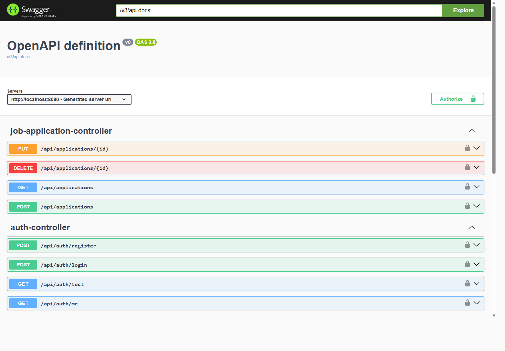

# HireForge Backend

HireForge Backend is a Spring Boot REST API for managing job applications. It provides user registration, login, JWT authentication, application CRUD operations, PostgreSQL persistence, and Swagger/OpenAPI documentation for testing the API.

Live API endpoint: https://hireforge-backend.onrender.com

## Screenshot

### Swagger API Documentation


## Features

- User registration and login
- Password hashing with BCrypt
- JWT generation and request authentication
- Protected job application endpoints
- Create, read, update, and delete job applications
- Paginated application listing per authenticated user
- PostgreSQL database integration with Spring Data JPA
- Validation for request bodies
- Centralized exception handling
- Swagger UI for API exploration
- Dockerfile and Docker Compose setup

## Tech Stack

- Java 21
- Spring Boot 3.2.5
- Spring Web
- Spring Security
- Spring Data JPA
- PostgreSQL
- JJWT
- Lombok
- Springdoc OpenAPI / Swagger UI
- Maven
- Docker
- Render

## Project Structure

```text
src/main/java/com/example/hireforge/
  config/             Web and OpenAPI configuration
  controller/         REST controllers
  dto/                Request and response objects
  entity/             JPA entities and enums
  exception/          API error handling
  repository/         Spring Data repositories
  security/           JWT and Spring Security configuration
  service/            Business logic
```

## API Overview

### Authentication

| Method | Endpoint | Description |
| --- | --- | --- |
| `POST` | `/api/auth/register` | Create a new user |
| `POST` | `/api/auth/login` | Login and receive a JWT |
| `GET` | `/api/auth/me` | Check authenticated access |
| `GET` | `/api/auth/test` | Backend health/test endpoint |

### Applications

| Method | Endpoint | Description |
| --- | --- | --- |
| `GET` | `/api/applications` | Get paginated applications for the logged-in user |
| `POST` | `/api/applications` | Create a job application |
| `PUT` | `/api/applications/{id}` | Update a job application |
| `DELETE` | `/api/applications/{id}` | Delete a job application |

Protected endpoints require:

```http
Authorization: Bearer <jwt-token>
```

## Application Status Values

The backend supports these job application statuses:

- `APPLIED`
- `SCREENING`
- `INTERVIEW`
- `OFFER`
- `ACCEPTED`
- `REJECTED`
- `WITHDRAWN`

## Local Setup

### Prerequisites

- Java 21
- PostgreSQL
- Maven Wrapper, included as `mvnw.cmd`

### Database

Create a PostgreSQL database named `hireforge`, or use the Docker Compose setup below.

Default local configuration:

```yaml
database: hireforge
username: postgres
password: password
host: localhost
port: 5432
```

You can override these values with environment variables:

```env
DB_URL=jdbc:postgresql://localhost:5432/hireforge
DB_USERNAME=postgres
DB_PASSWORD=password
JWT_SECRET=<your-secret>
```

For hosted deployment, configure the production database values in Render environment variables.

### Run Locally

```bash
./mvnw spring-boot:run
```

On Windows:

```powershell
.\mvnw.cmd spring-boot:run
```

The API runs at:

```text
http://localhost:8080
```

Swagger UI is available at:

```text
http://localhost:8080/swagger-ui/index.html
```

## Docker Setup

Run PostgreSQL and the backend together:

```bash
docker compose up --build
```

This starts:

- PostgreSQL on port `5432`
- Spring Boot API on port `8080`

## Render Deployment

Recommended Render settings:

```bash
Build command: ./mvnw clean install -DskipTests
Start command: java -jar target/*.jar
```

Required environment variables:

| Variable | Description |
| --- | --- |
| `DATABASE_URL` or `DB_URL` | PostgreSQL connection string |
| `DB_USERNAME` | Database username |
| `DB_PASSWORD` | Database password |
| `JWT_SECRET` | Secret used to sign JWT tokens |

## Example Requests

### Register

```bash
curl -X POST http://localhost:8080/api/auth/register \
  -H "Content-Type: application/json" \
  -d '{"name":"Akshay","email":"akshay@example.com","password":"password123"}'
```

### Login

```bash
curl -X POST http://localhost:8080/api/auth/login \
  -H "Content-Type: application/json" \
  -d '{"email":"akshay@example.com","password":"password123"}'
```

### Create Application

```bash
curl -X POST http://localhost:8080/api/applications \
  -H "Content-Type: application/json" \
  -H "Authorization: Bearer <jwt-token>" \
  -d '{"companyName":"Acme Corp","jobTitle":"Frontend Developer","status":"APPLIED"}'
```

## Development Approach

This backend was built as the API layer for HireForge. The implementation started with Spring Boot project setup, PostgreSQL persistence, and user registration. Authentication was added with Spring Security and JWT tokens, then application CRUD endpoints were connected to authenticated users. Swagger was added to make the API easier to inspect and test while the React frontend was being integrated.

## Related Repository

- Frontend app: `hireforge-frontend`
